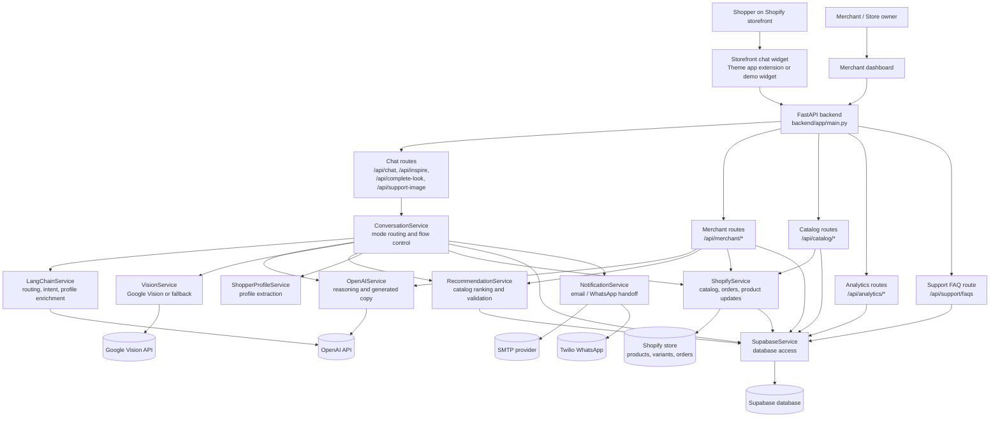

# StyledGenie Process And Architecture

This is the basic team document for understanding what we are building, what tools and APIs are being used, and how the main parts of StyledGenie work together.

## 1. Project Summary

StyledGenie is a Shopify-connected AI fashion assistant.

It has two separate customer-facing jobs:

- AI stylist: helps shoppers find outfits, complete a look, or get inspired from an image.
- AI support agent: helps shoppers with order tracking, returns, exchanges, shipping, product questions, and handoff to support.

The most important product rule is mode separation:

- Styling mode should show outfit logic and product recommendations.
- Support mode should stay short, action-oriented, and should not show styling UI.

## 2. Main Surfaces

| Surface | Folder | Purpose |
| --- | --- | --- |
| Storefront widget demo | `apps/storefront-widget/` | Local/demo customer chat experience. |
| Merchant dashboard app | `apps/merchant-dashboard/` and `backend/merchant-dashboard/` | Merchant setup, catalog intelligence, analytics, customer care, look management. |
| Backend API | `backend/app/` | FastAPI service that routes chat, image, support, catalog, merchant, and analytics requests. |
| Shopify theme extension | `shopify/theme-app-extension/` | Shopify app embed/block for the storefront chat widget. |
| Supabase schema | `supabase/` | Database tables, sample data, and schema updates. |
| Project docs | `docs/` | Setup, flows, API contracts, database, Shopify, Supabase, and production notes. |

## 3. Tools And Technologies

### Frontend

- HTML, CSS, and JavaScript for the current storefront widget and merchant dashboard.
- Browser `fetch` calls to talk to the FastAPI backend.
- Local static serving through FastAPI for:
  - `/storefront-widget-demo/`
  - `/merchant-dashboard/`

### Backend

- Python.
- FastAPI for API routes.
- Uvicorn for local backend server.
- Pydantic for request and response schemas.
- Python service classes for business logic.

### AI And Orchestration

- OpenAI API for reasoning, stylist responses, image interpretation, support copy, product descriptions, and look generation.
- LangChain for routing, profile enrichment, support intent classification, and structured AI orchestration.
- Google Vision API for image-first analysis before AI styling decisions.
- Local fallback heuristics when OpenAI, LangChain, Google Vision, Shopify, or Supabase are not configured.

### Commerce And Data

- Shopify Admin GraphQL API for catalog import, order lookup, access scopes, and product description updates.
- Shopify theme app extension for storefront widget placement.
- Supabase for products, tags, chat sessions, messages, recommendation events, support requests, merchant settings, curated looks, FAQs, knowledge base entries, and synced Shopify orders.

### Notifications

- SMTP for email handoff notifications.
- Twilio WhatsApp API for optional support handoff notifications.

### Local Development Tools

- `uvicorn` to run the backend.
- `ngrok` or another HTTPS tunnel to expose the backend to Shopify during development.
- Shopify CLI for app/theme-extension deployment.
- Supabase SQL editor or CLI for database setup.

## 4. External APIs

| API | Used For | Main Code Area |
| --- | --- | --- |
| OpenAI Responses API | Stylist reasoning, support replies, image interpretation, product descriptions, look builder output. | `backend/app/services/openai_service.py` |
| Google Cloud Vision API | Label detection, object localization, image properties, web detection, OCR. | `backend/app/services/vision_service.py` |
| Shopify Admin GraphQL API | Product sync, order sync, live order lookup, product description update, access scopes. | `backend/app/services/shopify_service.py` |
| Supabase API | Database reads/writes for products, sessions, events, merchant settings, support requests. | `backend/app/services/supabase_service.py` |
| SMTP | Email support handoff. | `backend/app/services/notification_service.py` |
| Twilio WhatsApp API | Optional WhatsApp support handoff. | `backend/app/services/notification_service.py` |

## 5. High-Level Architecture



## 6. Request Flow: Styling Text

Example: shopper asks, "I need a smart casual outfit under 150 euros."

1. Widget sends `POST /api/chat`.
2. `ConversationService` creates or loads the shopper session in Supabase.
3. `LangChainService` decides whether this is styling or support.
4. `ShopperProfileService` extracts occasion, budget, vibe, urgency, weather if inferable, and segment if provided.
5. If a critical field is missing, the assistant asks one focused question.
6. Before final outfit output, decision mode is requested: options or best pick.
7. `RecommendationService` shortlists catalog products from Supabase.
8. `OpenAIService` or `LangChainService` selects products and writes the explanation.
9. `RecommendationService` validates segment and product consistency.
10. Supabase logs the assistant message and recommendation event.
11. Widget renders the reply, product cards, "Why this works", and relevant actions.

## 7. Request Flow: Image Styling

Example: shopper uploads an image for "Complete my look" or "Get inspired."

1. Widget sends image details to:
   - `POST /api/complete-look`, or
   - `POST /api/inspire`.
2. `VisionService` analyzes the image first using Google Vision when configured.
3. If Google Vision is unavailable, local fallback image heuristics are used.
4. `OpenAIService` interprets visual signals into fashion language:
   - anchor item
   - garment types
   - color palette
   - silhouette
   - style direction
   - likely styling mode
5. `ConversationService` asks only critical missing questions such as menswear/womenswear, event, or weather.
6. `RecommendationService` finds matching or complementary products from the synced catalog.
7. `OpenAIService` writes the final recommendation and "Why this works".
8. Supabase logs the event and selected product IDs.
9. Widget renders image-aware recommendations.

## 8. Request Flow: Support

Example: shopper asks, "Track my order."

1. Widget sends `POST /api/chat` with support intent or support mode.
2. `LangChainService` classifies the support intent.
3. Styling logic is disabled for the response.
4. For order tracking, `ConversationService` asks for order number and email if missing.
5. `ShopifyService` attempts live Shopify lookup if order scopes are available.
6. If live lookup is unavailable, the system checks synced order snapshots in Supabase.
7. The assistant returns a short action-oriented status.
8. For handoff, `NotificationService` creates a support request and notifies the assigned contact by email or WhatsApp when configured.

## 9. Important Backend Routes

| Route | Purpose |
| --- | --- |
| `GET /health` | Backend health check. |
| `POST /api/chat` | Main text chat for styling and support. |
| `POST /api/inspire` | Image inspiration flow. |
| `POST /api/complete-look` | Image complete-the-look flow. |
| `POST /api/support-image` | Support image review for damaged/wrong item cases. |
| `POST /api/chat/refine` | Refine existing recommendations. |
| `POST /api/feedback` | Save shopper feedback. |
| `GET /api/support/faqs` | Return support FAQ content. |
| `POST /api/catalog/import` | Sync Shopify catalog and eligible orders into Supabase. |
| `GET /api/catalog/products` | List synced catalog products. |
| `GET /api/merchant/workspace` | Merchant dashboard workspace snapshot. |
| `PUT /api/merchant/profile` | Save merchant profile. |
| `PUT /api/merchant/chatbot-customization` | Save chatbot branding/tone settings. |
| `PUT /api/merchant/customer-care` | Save customer support FAQs/settings. |
| `POST /api/merchant/product-description-draft` | Generate AI product description draft. |
| `POST /api/merchant/product-description-apply` | Apply product description to Shopify. |
| `POST /api/merchant/look-builder` | Generate look drafts around a hero product. |

More route examples are in `docs/API_CONTRACTS.md`.

## 10. Database Tables

Main Supabase tables from `supabase/schema.sql`:

| Table | Purpose |
| --- | --- |
| `merchants` | Connected Shopify merchant/store record. |
| `products` | Synced Shopify products. |
| `product_tags` | Styling and catalog intelligence tags. |
| `curated_looks` | Merchant-approved outfit/look records. |
| `curated_look_items` | Product items inside a curated look. |
| `faqs` | Merchant support FAQs. |
| `knowledge_base_entries` | Brand rules, settings, policy content, catalog intelligence, customer care setup. |
| `chat_sessions` | Shopper conversation sessions. |
| `chat_messages` | Shopper and assistant messages. |
| `recommendation_events` | Styling/support events and selected product IDs. |
| `support_requests` | Human handoff records. |
| `shopify_orders` | Synced Shopify order snapshots. |
| `shopify_order_line_items` | Synced order line items and AI attribution metadata. |

## 11. Environment Variables

Backend settings are loaded in `backend/app/config.py`.

Core variables:

```env
OPENAI_API_KEY=
OPENAI_MODEL=gpt-5-mini

SUPABASE_URL=
SUPABASE_ANON_KEY=
SUPABASE_SERVICE_ROLE_KEY=
DEFAULT_MERCHANT_ID=

GOOGLE_VISION_API_KEY=
GOOGLE_APPLICATION_CREDENTIALS=
GOOGLE_SERVICE_ACCOUNT_JSON=
GOOGLE_CLOUD_PROJECT=

SHOPIFY_API_VERSION=2026-01
SHOPIFY_APP_NAME=
SHOPIFY_APP_URL=
SHOPIFY_STORE_DOMAIN=
SHOPIFY_STOREFRONT_DOMAIN=
SHOPIFY_CLIENT_ID=
SHOPIFY_CLIENT_SECRET=
SHOPIFY_ADMIN_ACCESS_TOKEN=
SHOPIFY_ORDERS_LOOKBACK_DAYS=60

SMTP_HOST=
SMTP_PORT=587
SMTP_USERNAME=
SMTP_PASSWORD=
SMTP_FROM_EMAIL=
SMTP_REPLY_TO=
SMTP_USE_TLS=true
SMTP_USE_SSL=false

TWILIO_ACCOUNT_SID=
TWILIO_AUTH_TOKEN=
TWILIO_WHATSAPP_FROM=
```

## 12. Local Development Process

1. Install backend dependencies.

```bash
cd backend
pip install -r requirements.txt
```

2. Configure `.env` with Supabase, OpenAI, Google Vision, and Shopify values.

3. Set up Supabase database.

```text
Run supabase/schema.sql, then supabase/sample_seed.sql.
For a clean dev reset, follow docs/SUPABASE_SETUP.md.
```

4. Start the backend.

```bash
cd backend
uvicorn app.main:app --host 127.0.0.1 --port 8000
```

5. Check health.

```bash
curl http://127.0.0.1:8000/health
```

6. Open local surfaces.

```text
http://127.0.0.1:8000/storefront-widget-demo/
http://127.0.0.1:8000/merchant-dashboard/
```

7. If testing Shopify, expose backend over HTTPS.

```bash
ngrok http 8000
```

8. Use the HTTPS tunnel URL in Shopify app settings and in the theme app embed's backend API base URL.

## 13. Shopify Process

1. Confirm Shopify app credentials and access scopes.
2. Confirm the app has required scopes for the features being tested:
   - product read for catalog import
   - order read for order tracking/synced metrics
   - product write for applying product descriptions
3. Enable the StyledGenie theme app embed in the dev store theme.
4. Set the backend API base URL to the current HTTPS backend URL.
5. Run catalog import from the merchant dashboard or `POST /api/catalog/import`.
6. Test product cards:
   - image
   - title
   - price
   - product URL
   - variant ID
   - add-to-cart fallback behavior

Note: the current `shopify.app.toml` should be validated before deployment because its checked-in content may not be a valid TOML app config.

## 14. Team Working Process

Use this order when adding or changing features:

1. Confirm the mode first: styling or support.
2. Check existing docs:
   - `docs/DETAILED_FUNCTIONAL_FLOWS.md`
   - `docs/API_CONTRACTS.md`
   - `docs/DATABASE_GUIDE.md`
3. Update the smallest relevant service or UI file.
4. Reuse existing service classes rather than creating a new architecture.
5. Add or update API schema only when the frontend/backend contract changes.
6. Run the backend health check.
7. Test the relevant customer flow in the storefront widget.
8. Test the matching merchant dashboard area when merchant data is involved.
9. Log any known limitation in docs or tickets.

## 15. Current Implementation Priorities

These priorities come from the product rules in `AGENTS.md`:

1. Mode separation.
2. Image-first logic.
3. Gap analysis for Complete My Look.
4. Hero-first recommendation for Get Inspired.
5. Decision mode for Find My Outfit.
6. Smart swap without regenerating the full outfit.

## 16. Basic QA Checklist

### Backend

- `/health` returns `{"status":"ok"}`.
- `/api/chat` works for a styling request.
- `/api/chat` switches cleanly to support for tracking/returns/shipping.
- `/api/inspire` analyzes an uploaded image or URL.
- `/api/complete-look` analyzes image first and recommends missing pieces.
- `/api/catalog/import` imports Shopify products when credentials are configured.

### Storefront Widget

- Customer can open the widget.
- Styling and support UI do not mix.
- Product cards show real catalog products.
- "Why this works" appears for recommendations.
- Image upload flow does not ask generic questions before image analysis.
- Add-to-cart and product links behave correctly where Shopify data is available.

### Merchant Dashboard

- Workspace loads without breaking.
- Catalog sync can be triggered.
- Chatbot customization saves.
- Customer care setup saves.
- Product description draft generation works when OpenAI is configured.
- Apply-to-Shopify is blocked clearly when `write_products` scope is missing.

### Support

- Order tracking asks for order ID/email if missing.
- Returns/exchanges identify the order before suggesting next steps.
- Support answers stay short.
- Human handoff creates a support request.
- Email/WhatsApp notifications only run when configured.

## 17. Who Owns What

| Area | Primary Responsibility |
| --- | --- |
| Storefront widget | Customer UX, chat rendering, image upload, product cards, add-to-cart. |
| Backend API | Routing, validation, orchestration, response contracts. |
| AI services | Reasoning, profile extraction, visual interpretation, recommendations, support reply shaping. |
| Shopify service | Catalog, orders, variants, product URLs, product write-back. |
| Supabase service | Persistence, analytics data, merchant settings, support requests. |
| Merchant dashboard | Store setup, catalog intelligence, customer care rules, analytics, look management. |
| QA | End-to-end testing across local demo, Shopify dev store, backend logs, and Supabase data. |

## 18. Handoff Notes

- Keep responses short and decision-led.
- Ask fewer questions by extracting intent from text, image, and prior context.
- Always analyze images before asking follow-up questions.
- Never show styling recommendations during support mode.
- Recommendations must explain color harmony, silhouette balance, occasion fit, and style direction.
- Use real Shopify catalog data whenever possible.
- Keep all changes small and aligned with existing service boundaries.
